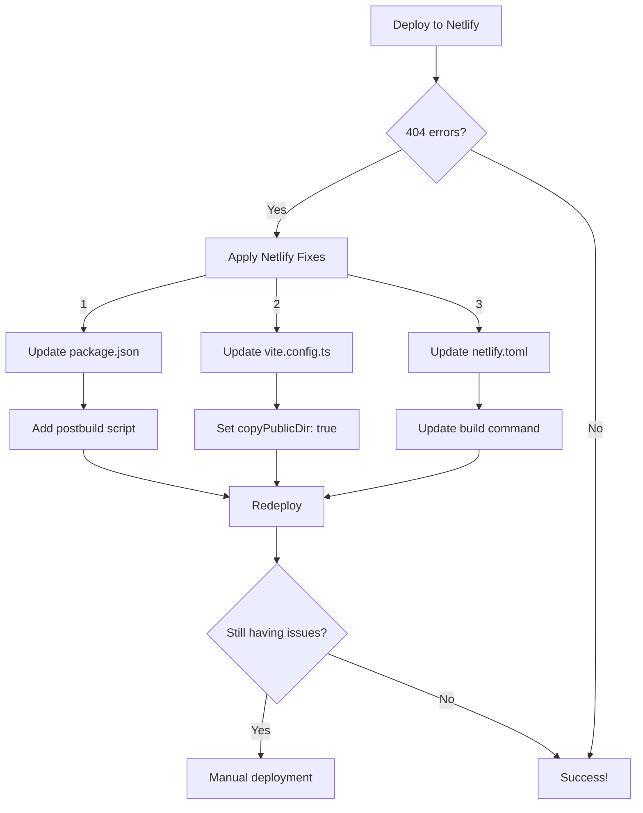

# Midnight Magnolia Website: Deployment Strategy

## 🔍 Current Deployment Issues

| Platform | Issue | Root Cause | Fix Status |
|----------|-------|------------|------------|
| **Netlify** | 404 errors on page refresh | SPA routing configuration | Fix documented |
| **Railway** | Caching issues | Stale build cache | Workarounds available |
| **Vercel** | Slow deployments | Build optimization needed | Not yet addressed |

## 📋 Local Preview Options

Before attempting deployment, ensure the site works locally:

```bash
# Development mode (fast refresh)
npm run dev

# Production build preview (most accurate)
npm run build
npm run preview
```

## 🔧 Fixing Netlify 404 Issues

The 404 errors on page refresh are a common issue with Single Page Applications (SPAs). Your `netlify-deployment-fix.md` has the solution:



### Implementation Steps:

1. **Verify _redirects file** (already exists with correct content)
2. **Update package.json** (already done):
   - Ensure postbuild script exists: `"postbuild": "cp _redirects dist/_redirects || cp public/_redirects dist/_redirects || echo 'No _redirects file found!'"`

3. **Update vite.config.ts** (already done):
   - Ensure `copyPublicDir: true` is set in build options

4. **Update netlify.toml** (already done):
   - Build command set to: `npm run build && npm run postbuild`

5. **Deploy to Netlify**:
   - Clear cache and deploy site
   - Verify routes work after refresh

## 🔄 Resolving Railway Caching Issues

Railway's caching issues need a more aggressive approach:

1. **Complete Reset (Recommended)**:
   - Delete the current Railway service
   - Create a new service from your GitHub repository
   - Configure fresh build settings

2. **Alternative: Clear Cache**:
   - Go to Railway dashboard → Settings → Danger Zone
   - Click "Clear Build Cache"
   - Trigger a new deployment

3. **Environment Variables**:
   - Add `NIXPACKS_NODE_VERSION=18`
   - Add `NPM_CONFIG_CACHE=/tmp/.npm`

## ⚡ Optimizing Vercel Deployments

To improve Vercel deployment speed:

1. **Optimize Build Process**:
   - Add Vercel-specific build optimizations in `vercel.json`:
```json
{
  "builds": [
    {
      "src": "package.json",
      "use": "@vercel/node",
      "config": { "distDir": "dist" }
    }
  ],
  "routes": [
    { "src": "/(.*)", "dest": "/index.html" }
  ]
}
```

2. **Cache Dependencies**:
   - Ensure `node_modules` caching is enabled
   - Consider adding `.vercelignore` for files not needed in build

## 🏆 Recommended Deployment Strategy

Based on your specific issues:

1. **First Choice: Netlify**
   - Implement the fixes documented in `netlify-deployment-fix.md`
   - Test thoroughly, especially page refreshes
   - Advantages: Great for SPAs, automatic SSL, CDN, easy configuration

2. **Second Choice: Vercel**
   - Create `vercel.json` with optimization settings
   - Advantages: Good React support, deployment previews

3. **Third Choice: Railway**
   - Use only if needed for specific backend requirements
   - Start fresh with new service to avoid caching issues

## 🔍 Deployment Verification Checklist

For any platform, verify:
- [ ] Home page loads correctly
- [ ] Navigation works between pages
- [ ] Page refreshes work without 404 errors
- [ ] All assets (images, CSS, JS) load properly
- [ ] Responsive design works on different devices

## 📞 Support Resources

- [Netlify SPA Documentation](https://docs.netlify.com/routing/redirects/rewrites-proxies/#history-pushstate-and-single-page-apps)
- [Vercel Build Optimization](https://vercel.com/docs/concepts/deployments/build-optimization)
- [Railway Troubleshooting](https://docs.railway.app/troubleshoot/fixing-builds)